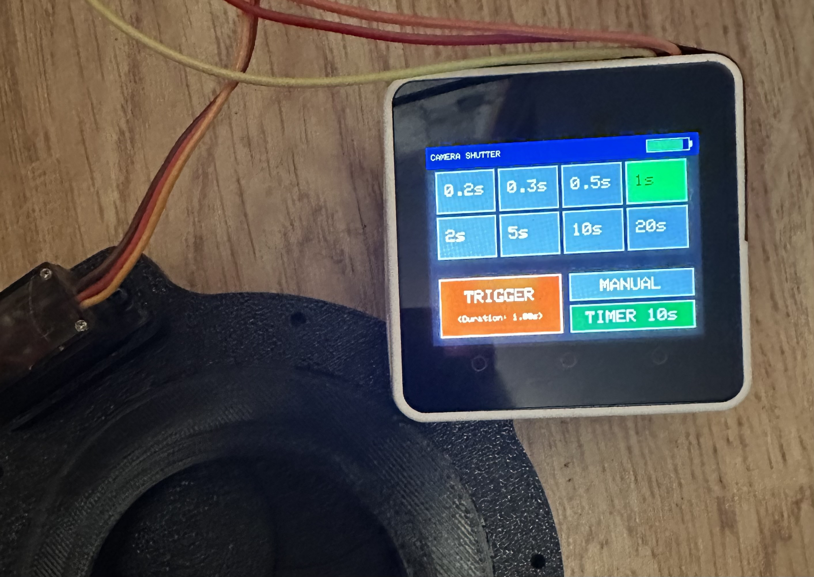

# Large Format Camera Shutter Controller

[](https://opensource.org/licenses/MIT)
[](https://github.com/sylvainf/M5Core2-Camera-Shutter)

A modern touchscreen controller for the [Servo-Shutter](https://github.com/hackaninstant/Servo-Shutter) 3D printed leaf shutter designed by hackaninstant (thank you for sharring your great design. This project replaces the original Arduino Nano + OLED + buttons setup with an M5Stack Core2, providing an intuitive touchscreen interface and enhanced features.


*Touchscreen interface with multiple exposure modes*

## 📸 Overview

This controller is designed for **large format photography** with slow speed films (paper negatives, X-Ray film, Lith film). It drives the servo-operated leaf shutter mechanism with precise timing control and a modern user interface.

### Why M5Core2?

- **Touchscreen Interface**: Intuitive 320x240 color display replaces buttons and small OLED
- **Built-in Battery**: Rechargeable Li-Po with charge indicator and power management
- **Compact Design**: All-in-one unit (ESP32 + display + battery + charging circuit)
- **WiFi Capable**: Future expansion possibilities (remote triggering, settings backup)
- **Easy Programming**: USB-C connection with Arduino IDE support

## ✨ Features

### Core Functions
- **8 Preset Durations**: 0.2s, 0.3s, 0.5s, 1.0s, 2.0s, 5.0s, 10.0s, 20.0s
- **Instant Trigger**: Single tap to fire with selected duration
- **Manual Mode**: Toggle button for open/close control (focus & composition)
- **10s Self-Timer**: Countdown display with automatic trigger

### Interface
- **Visual Duration Selection**: Touch-activated buttons with color-coded selection
- **Battery Indicator**: Real-time battery level (green/yellow/red) with charging status
- **Live Countdown**: Timer display updates in real-time
- **Professional Layout**: Clean, photographer-friendly interface

### Power Management
- **Servo Auto-Detach**: Automatically disconnects servo after each action to save battery
- **Efficient Updates**: Battery display refreshes every 5 seconds
- **Rechargeable**: USB-C charging while in use

## 🛠️ Hardware Requirements

### Electronics
| Component | Model | Notes |
|-----------|-------|-------|
| Controller | M5Stack Core2 | ESP32-based with touchscreen |
| Servo | SG90 9g Micro Servo | Standard 180° servo |


### Mechanical Parts
- **3D Printed Shutter**: [Servo-Shutter by hackaninstant](https://github.com/hackaninstant/Servo-Shutter)
- **STL Files**: Available on Thingiverse #6033871
- Print settings: 0.2mm layer height, PLA recommended

### Wiring
```
M5Core2 Port A (Red Grove connector)
├─ Pin 32 (White wire) → Servo Signal
├─ 5V (Red wire) → Servo VCC
└─ GND (Black wire) → Servo GND
```

**Note**: Port A uses GPIO 32 by default. Pin 33 (yellow wire) can also be used with code modification.


## 🎯 Usage Guide

### Basic Operation
1. **Select Duration**: Tap one of the 8 duration buttons (green = selected)
2. **Focus/Compose**: Use MANUAL button to open shutter (blue = open)
3. **Trigger**: Press red TRIGGER button to take photo
4. **Self-Timer**: Press TIMER 10s for delayed exposure


### Customizing Durations
Modify the `durations[]` array:
```cpp
float durations[] = {0.2, 0.3, 0.5, 1.0, 2.0, 5.0, 10.0, 20.0};
```

## 📧 Contact

For questions or suggestions, please open an issue on GitHub.